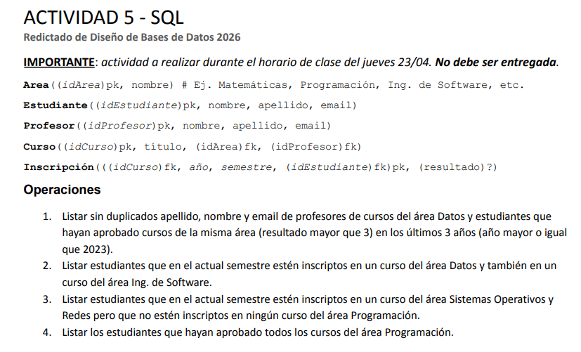

1.  SELECT p.apellido, p.nombre, p.email
    FROM Profesor p 
    INNER JOIN Curso c ON (c.idProfesor = p.idProfesor)
    INNER JOIN Area a ON (c.idArea = a.idArea)
    WHERE a.nombre = ‘Datos’
    
    UNION
    
    SELECT e.apellido, e.nombre, e.email
    FROM Estudiante e 
    INNER JOIN Inscripción i ON (e.idEstudiante=i.idEstudiante)
    INNER JOIN Curso c ON (i.idCurso=c.idCurso)
    INNER JOIN Area a ON (c.idArea = a.idArea)
    WHERE a.nombre = ‘Datos’
    AND resultado > 3 
    AND i.año >= 2023

2.  SELECT e.nombre, e.apellido, e.email
    FROM Estudiante e
    INNER JOIN Inscripción i ON (e.idEstudiante=i.idEstudiante)
    INNER JOIN Curso c ON (i.idCurso = c.idCurso)
    INNER JOIN Area a ON (a.idArea = c.idArea)
    WHERE (i.semestre = 1)
    	AND (i.año = 2026)
    AND (c.nombre = ‘Datos’)
    
    INTERSECT
    
    SELECT e.nombre, e.apellido, e.email
    FROM Estudiante e
    INNER JOIN Inscripción i ON (e.idEstudiante=i.idEstudiante)
    INNER JOIN Curso c ON (i.idCurso = c.idCurso)
    INNER JOIN Area a ON (a.idArea = c.idArea)
    WHERE (i.semestre = 1)
    	AND (i.año = 2026)
    AND (a.nombre = ‘Ing. de Software’)

3.  SELECT e.nombre, e.apellido, e.email
    FROM Estudiante e
    INNER JOIN Inscripción i ON (e.idEstudiante=i.idEstudiante)
    INNER JOIN Curso c ON (i.idCurso = c.idCurso)
    INNER JOIN Area a ON (c.idArea = a.idArea)
    WHERE (i.semestre = 1)
    	AND (i.año = 2026)
    	AND (a.nombre = ‘Sistemas Operativos y Redes’) 
    
    EXCEPT
    
    SELECT e.nombre, e.apellido, e.mail
    FROM Estudiante e
    INNER JOIN Inscripción i ON (e.idEstudiante=i.idEstudiante)
    INNER JOIN Curso c ON (i.idCurso = c.idCurso)
    INNER JOIN Area a ON (c.idArea = a.idArea)
    WHERE (i.semestre = 1)
    	AND (i.año = 2026)
    	AND (a.nombre = ‘Programación’)

4.  SELECT e.idEstudiante, e.nombre, e.apellido, e.email
    FROM Estudiante e
    INNER JOIN Inscripción i 
    ON (e.idEstudiante = i.idEstudiante)
    INNER JOIN Curso c ON (i.idCurso = c.idCurso)
    INNER JOIN Area a ON (c.idArea = a.idArea)
    WHERE (a.nombre = ‘Programación’)
    	AND (i.resultado > 3)
    
    GROUP BY e.idEstudiante, e.nombre, e.apellido, e.email HAVING COUNT (DISTINCT c.idCurso) = ( 
    SELECT COUNT(idCurso) 
    FROM Curso c2
    JOIN Area a2 ON (c2.idArea = a2.idArea)
    WHERE a2.nombre = 'Programación' 
    );
